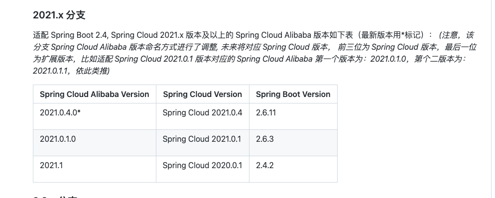
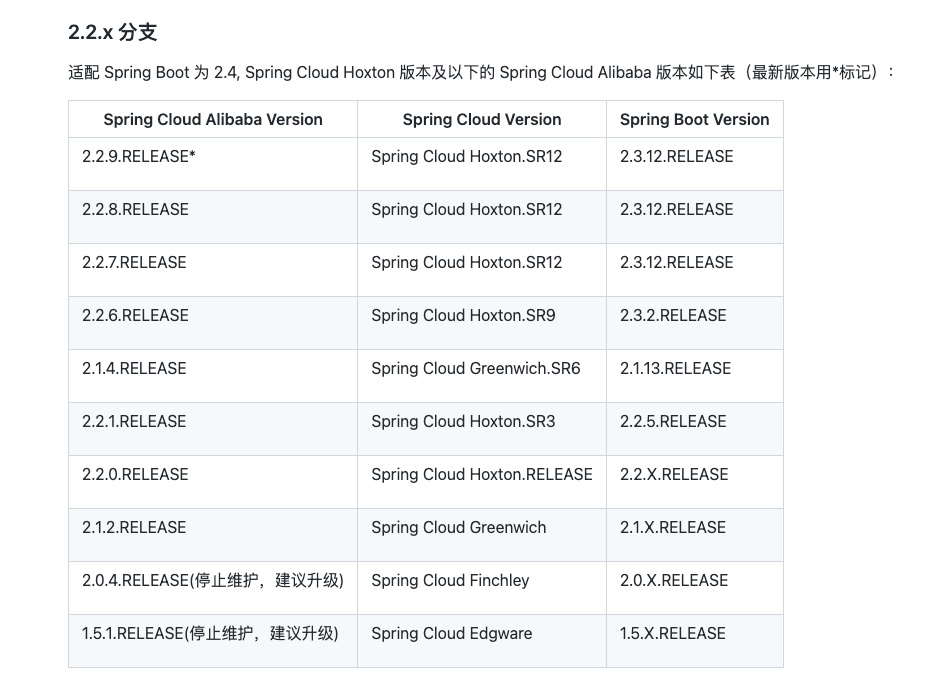

# collect
汇总


SpringCloudAlibaba版本说明

https://github.com/alibaba/spring-cloud-alibaba/wiki/%E7%89%88%E6%9C%AC%E8%AF%B4%E6%98%8E

用最新的


SpringBoot   2.7.4

Spring Cloud Alibaba   2021.0.4.0*

Spring Cloud     2021.0.4






nacos下载地址（下载版本，目前最新2.1.1)
https://github.com/alibaba/nacos/tags

下载后启动
```xml
cd nacos/bin
sh startup.sh -m standalone
```
