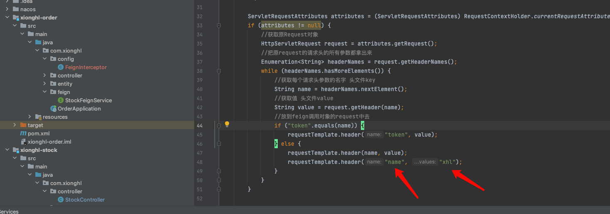
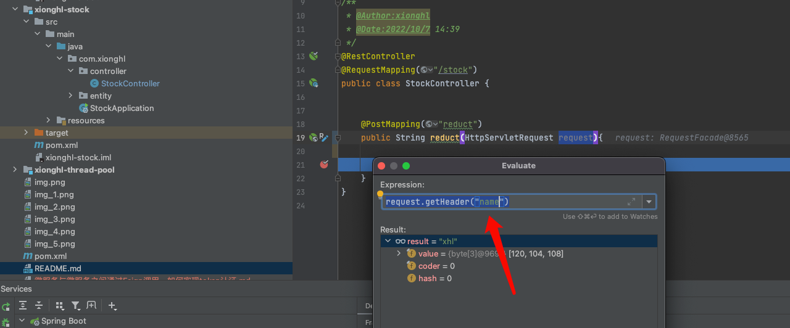
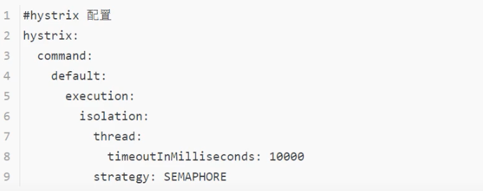
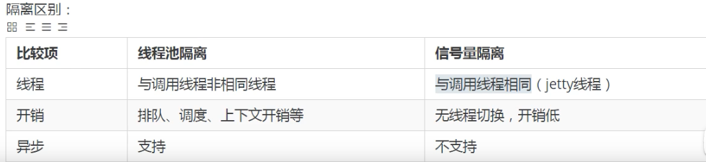

问题：微服务与微服务之间通过Feign调用，token如何实现认证？

答案：重写feign中RequestInterceptor接口（谁调用谁重写），重写apply方法往原线程请求头中添加鉴权信息即可

服务发起方：

调用方：

注意：
hystrix隔离策略
微服务之间相互调用,如果使用Feign调用,如果开启feign熔断, Hystrix的隔离策略默认采用的是线程池，feign调用和请求的线程不属于同一个线程, RequestContextHolder源码中,使用了两个ThreadLocal，无法获取请求的线程数据,会造成空指针异常。

解决方案：hystrix隔离策略更改为SEMAPHORE（信号量）
在服务发起方的yml文件中配置

