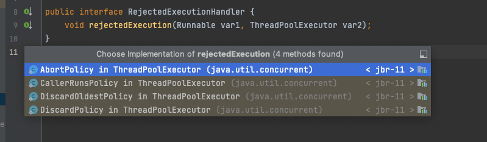
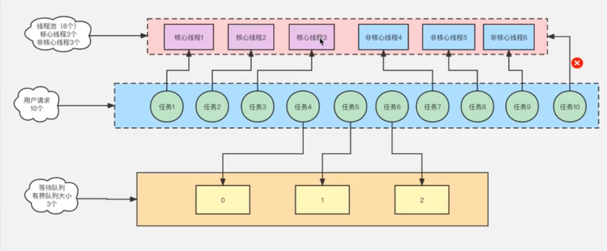

创建一个可缓存线程池，如果线程池长度超过处理需要，可灵活回收空闲线程，若无可回收，则新建线程。
在使用newCachedThreadPooL时，一定要注意控制任务的数量，否则，由于大量线程同时运行，很有会造成系统瘫痪。
Executors.newScheduLedThreadPool()
创建一个可以执行延迟任务的线程池。
Executors.newWorkStealingPool()
创建一个抢占式执行的线程池(任务执行顺序不确定) ,这是一个经常被人忽略的线程池，Java 8才加入这个创建方法，其内部会构建ForkJoinPool,利用Work-SteaLing算法，并行地处理任务，不保证处理顺序。

2)  ThreadPoolExecutor创建线程池

最原始的創建銭程池的方式，它包含了7个参数可供没置,如下所示:

new ThreadPoolExecutor (int corePoolSize,
int maximumPoolSize,
long keepAliveTime,
TimeUnit unit,
BlockingQueue workQueue,
ThreadFactory threadFactory,
RejectedExecutionHandler handler)

创建线程池-共有7个参数:

corePoolSize : 线程池核心线程数，在不用的时候也不会被回收。
maximumPoolSize : 线程池中可以容纳的最大线程数量。
keepAliveTime : 线程池非核心线程最长存活时间，在线程池中，核心线程即使在无任务的情况下也不能被清除，其余的线程都是有存活时间的。
unit : 存活的时间单位。
workQueue : 等待队列，任务可以存储在任务队列中等待被执行，执行的原则是FIFO(先迸先出) 。
threadFactory : 创建线程的线程工厂，JDK提供默认的 Executors.defaultThreadFactory()。
handler : 拒绝策略，我们可以在任务满了之后，拒绝执行某些任务。

拒绝策略，拒绝处理任务时的策略，系统提供了4种可选:

AbortPolicy : 该策略是线程池的默认策略，拒絶并抛出异常。使用垓策略吋，如果线程池队列满了会丢掉这个任务并且抛出RejectedExecutionException昇常。
CallerRunsPolicy : 使用此策略，如果添加到线程池失败，那幺主线程会自己去执行该任务，不会等待线程池中的其它线程去执行。
DiscardOldestPolicy :这个策略从字面上也很好理解，丢弃最老的。也就是说如果队列满了,会将最早迸入队列的任务删除并且腾出空间，再尝试加入队列。因为队列是队尾进，队头出，所以队头元素是最老的，因此每次都是移除队头元素后再尝试入队。
其他：
自定义拒绝策略: 如果以上策略都不符合业务场景，那么可以自己定义一个拒绝策略，只要实现RejectedExecutionHandler接口，并且重写rejectedExecution方法即可

这几种策略没有好坏之分，只是适用不同场景，具体哪种合适根据具体场景和业务需要选择,如果需要特殊处理就自己定义好了。

四、线程池工作流程图

五、选用哪种线程池

我们来看下阿里巴巴《Java开发手册》给我们的答案:
线程池不允许使用Executors去创建，而是通过ThreadPooLExecutor的方式，这样的处理方式让写的同学更加明确线程池的运行规则，规避资源耗尽的风险。
说明: Executors 返回的线程池对象的弊端如下:
1. FixedThreadPool 和 SingLeThreadPool: 允许的请求队列长度为Integer.MAX_VALUE,可能会堆积大量的请求，
   我们知道每个线程默认情况下占1M的内存空间，如果线再
2. CachedThreadPool: 允许的创建线程数量为Integer.MAX_VALUE,可能会创建大量的线程，
   我们知道每个线程默认情况下占1M的内存空间，如果线程非常多，内存资源将会被 所以综上情况所述，我们最推荐使用new ThreadPoolExecutor()的方式进行线程池的创建，因为这种创建方式更可控，并且更加明确了线程池的运行规则，可以规避一些未知的风险。

六、如何定义线程池大小

获取CPU核数N  = Runtime.getRuntime().availableProcessors();

1. 经验值
   I/O密集型(其中N为CPU的个数)
   I/O密集型应用，大部分时间都在进行I/O操作, CPU占用率不高
   例如: MySQL数据库.文件的读写、网络通信等,这类操作不会消耗太多CPU资源,但是IO操作特别耗时，会占用比较多的时间，CPU相对比较空闲，为了更好的利用CPU，不让CPU闲下 所以应加大线程数量，建议: 线程池大小= 2N+1

CPU密集型(其中N为CPU的个数)
CPU密集型任务也叫计算密集型任务，几乎没有I/O操作,这种类型CPU使用时间远高于I/O耗时，计算要处理、许多逻辑判断,频繁切换上下线程是不明智的,此时应该设置-个较小的线程数，建议:线程池大小= N+1

2. 最佳计算公式

最佳线程数= ( (线程等待时间+线程CPU时间) /线程CPU时间)*CPU数目

因为很显然，线程等待时间所占比例越高，需要越多线程。线程CPU时间所占比例越高，需要越少线程。

虽说最佳线程数算法更准确，但是线程等待时间和线程CPU时间不好测量，实际情况使用得比较少，一般用经验值就差不多了。再配合系统压测，基本可以确定最适合的线程数。以上设置仅供参考，线程数的设置可以根据实际的压测，监控JVM的线程情况以及CPU的负载情况，根据实际情况创建合理的线程数，充分利用资源。

七、线程池应用场景

1. 异步处理(高并发下不适合，采用mq替代)
2. 并行处理(建议使用CompletableFuture)
